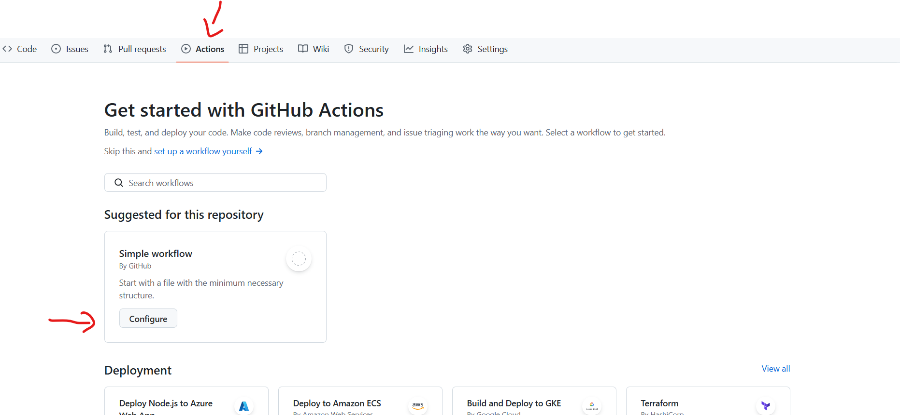
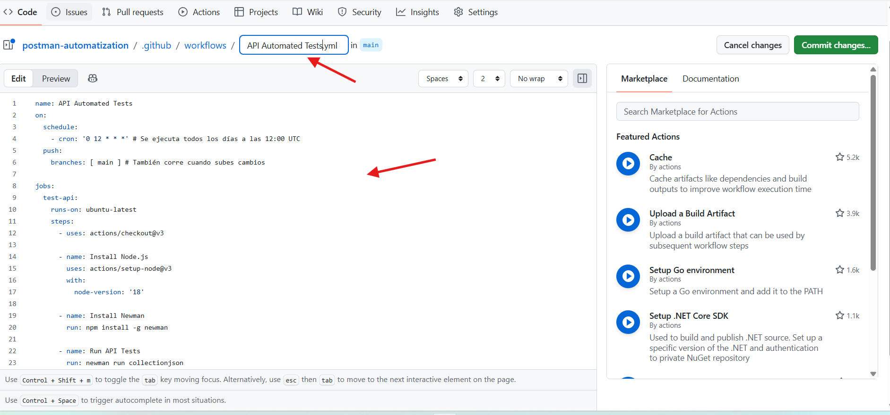

# 🚀 Manual de Automatización de Pruebas de API con Postman y Newman

Este manual describe el proceso paso a paso para implementar, ejecutar y programar pruebas automatizadas de backend utilizando la API de **JSONPlaceholder** como ejemplo.

---

## 1. Configuración de la Colección en Postman

### A. Crear la Petición
1. Abre Postman y crea una nueva **Collection** llamada `API_Automation_Project`.
2. Dentro de la colección, añade una nueva solicitud (**Add Request**):
   - **Nombre:** `Crear Post`
   - **Método:** `POST`
   - **URL:** `https://jsonplaceholder.typicode.com/posts`
3. En la pestaña **Body**:
   - Selecciona **raw** y formato **JSON**.
   - Pega el siguiente JSON:
     ```json
     {
       "title": "Post Automatizado",
       "body": "Contenido de prueba",
       "userId": 1
     }
     ```

### B. Agregar Scripts de Validación (Tests)
Haz clic en la pestaña **Tests** de la petición y pega este bloque de código:

```javascript
// Validar que el código de estado sea 201 (Creado)
pm.test("Status code es 201", function () {
    pm.response.to.have.status(201);
});

// Validar que la respuesta sea en formato JSON
pm.test("La respuesta es un JSON válido", function () {
    pm.response.to.be.withBody;
    pm.response.to.be.json;
});

// Validar que el título coincida con el enviado
pm.test("El título devuelto es correcto", function () {
    var jsonData = pm.response.json();
    pm.expect(jsonData.title).to.eql("Post Automatizado");
});

pm.test("Validar que los campos obligatorios están presentes", function () {
    var jsonData = pm.response.json();
    
    // Verifica que el campo existe
    pm.expect(jsonData).to.have.property('id');
    pm.expect(jsonData).to.have.property('title');
    pm.expect(jsonData).to.have.property('body');
    pm.expect(jsonData).to.have.property('userId');
});

// Validar tiempo de respuesta
pm.test("Tiempo de respuesta menor a 400ms", function () {
    pm.expect(pm.response.responseTime).to.be.below(400);
});
```

## 💻 Ejecución Automática en macOS (Paso a Paso)
Para automatizar la ejecución en tu Mac y evitar el proceso manual, sigue estos pasos:

### A. Preparar los Archivos
1. Exporta tu colección desde Postman como coleccion_api.json.
2. Guárdala en una ruta conocida, por ejemplo: ~/Documents/QA/.

## 2. Ejecución Manual por Terminal
Instala y corre el paquete  donde collection.json es el archivo que exportaste de Postman, con el siguiente comando: 


> **versiones recientes de node**

```bash

sudo npm install -g newman@latest newman-reporter-htmlextra@latest 

```

### para correr por consola 
```bash
newman run collection.json
```

> **versiones mas antiguas de node**

```bash
sudo npm install -g newman newman-reporter-htmlextra
```

### para correr por consola con reporter
```bash
newman run collection.json -r cli,htmlextra --reporter-htmlextra-export ./reporte_final.html
```


newman run collection.json 
```

> **Nota:** Si no reconoce el comando newman cierra y abre la terminal de nuevo. newman-reporter-htmlextra Para transformar los resultados de la consola en reportes visuales interactivos


#### en la carpeta donde esta je json 
```bash
sudo npm install newman-reporter-html
```

### Para automatizar esto en Mac y que se ejecute solo (sin que tengas que darle al botón de "Run"), tienes dos caminos principales: 

1. localmente usando el Calendario/Terminal de tu Mac, 
2. de forma más profesional usando GitHub Actions.

### Localmente
#### A. Crea un script de ejecución: Crea un archivo llamado ejecutar_tests.sh en tu carpeta de documentos:
 ```bash 
 nano ~/Documents/ejecutar_tests.sh  
 ```

 #### B. Pega esto dentro (ajusta la ruta a tu archivo JSON):

 - sin reporter
 ```bash 
 #!/bin/bash
/usr/local/bin/newman run /Users/TU_USUARIO/Documents/collection.json
```
 - con reporter Para decidir dónde se guarda el reporte y qué nombre tendrá, usa el flag --reporter-htmlextra-export
 ```bash 
 #!/bin/bash
/usr/local/bin/newman run /Users/TU_USUARIO/Documents/collection.json -r cli,html --reporter-html-export /Users/TU_USUARIO/Documents/reporte.html
```

. ***Nota*** las rutas deben ser las tuyas

#### C Dale permisos de ejecución:

```bash 
chmod +x ~/Documents/ejecutar_tests.sh
```

#### D Prográmalo con Crontab: Escribe crontab -e en la terminal. Si quieres que corra todos los días a las 9:00 AM, añade esta línea al final:

```bash 
00 09 * * * /Users/TU_USUARIO/Documents/ejecutar_tests.sh
```

> **formato tiempo**
```
┌──────── Minute (0 - 59)
│ ┌────── Hour (0 - 23)
│ │ ┌──── Day of Month (1 - 31)
│ │ │ ┌── Month (1 - 12)
│ │ │ │ ┌─ Day of Week (0 - 7) (Domingo=0 o 7)
│ │ │ │ │
* * * * *  comando
```


### GitHub Actions.
#### A. Esta es la mejor forma porque no depende de que tu Mac esté encendido. Se ejecuta en la nube de GitHub cada vez que subes código o en un horario fijo.

- Crea un repositorio en GitHub y sube tu archivo collection.json si no existe

- En el repositorio, ve a la pestaña Actions.

- Haz clic en "set up a workflow yourself" y pega este código (YAML):
```
name: API Automated Tests
on:
  schedule:
    - cron: '0 12 * * *' # Se ejecuta todos los días a las 12:00 UTC
  push:
    branches: [ main ] # También corre cuando subes cambios

jobs:
  test-api:
    runs-on: ubuntu-latest
    steps:
      - uses: actions/checkout@v3

      - name: Install Node.js
        uses: actions/setup-node@v3
        with:
          node-version: '18'

      - name: Install Newman
        run: npm install -g newman

      - name: Run API Tests
        run: newman run collectionjson
```

> **Nota:** 
  es importante que el archivo collection.json este en la carpeta .github/workflows

  ### para crearlo debes ir actions luego configure y crear un workflow manualmente como aparece en la imagen
  

  ### Luego pones un nombre para el workflow y pones el codigo que esta arriba en la imagen
  

# 🚀 GitHub Action con Reporte HTML Automatizado

Este archivo configura la ejecución diaria de tus pruebas y guarda el reporte visual como un "Artefacto" de GitHub, permitiéndote descargar el informe detallado después de cada ejecución.

---

## 📄 Configuración del Workflow (.github/workflows/api_tests.yml)

Copia y pega este código en tu archivo YAML:

```
yaml
name: API Automated Tests
on:
  schedule:
    - cron: '0 12 * * *' # Ejecución diaria a las 12:00 UTC
  push:
    branches: [ main ] # Ejecución al subir cambios a main
  workflow_dispatch: # Permite ejecutar el test manualmente desde el botón "Run workflow"

jobs:
  test-api:
    runs-on: ubuntu-latest
    steps:
      - name: 1. Descargar código del repositorio
        uses: actions/checkout@v3

      - name: 2. Configurar Node.js
        uses: actions/setup-node@v3
        with:
          node-version: '18'

      - name: 3. Instalar Newman y Reportero HTML
        run: |
          npm install -g newman
          npm install -g newman-reporter-htmlextra

      - name: 4. Ejecutar Pruebas y Crear Reporte
        # Nota: Asegúrate de que el nombre de tu archivo .json sea correcto
        run: |
          mkdir -p reports
          newman run collection.json -r htmlextra --reporter-htmlextra-export reports/reporte_api.html

      - name: 5. Subir Reporte como Artefacto
        # Esto guarda el archivo en GitHub para que lo puedas descargar
        if: always() # Se ejecuta incluso si los tests fallan
        uses: actions/upload-artifact@v4
        with:
          name: reporte-de-pruebas-api
          path: reports/reporte_api.html
```

